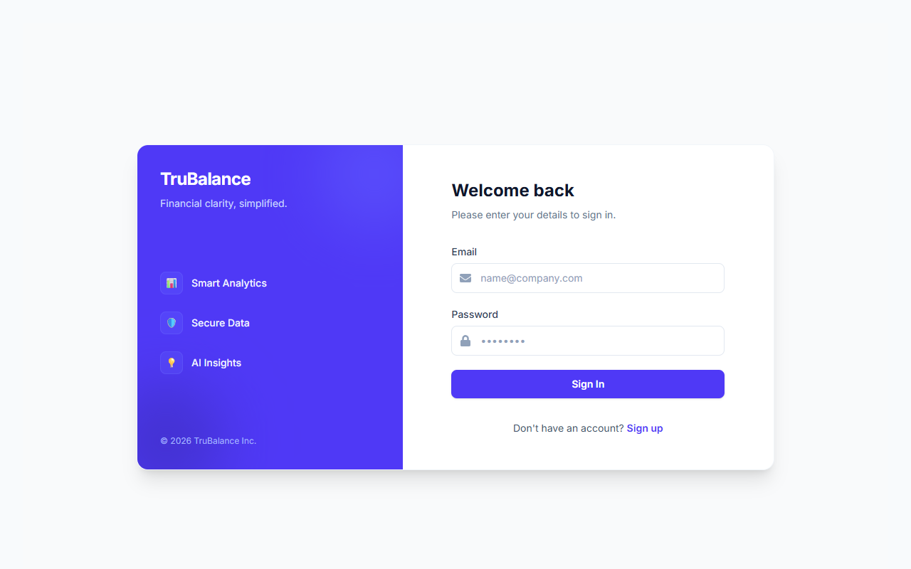
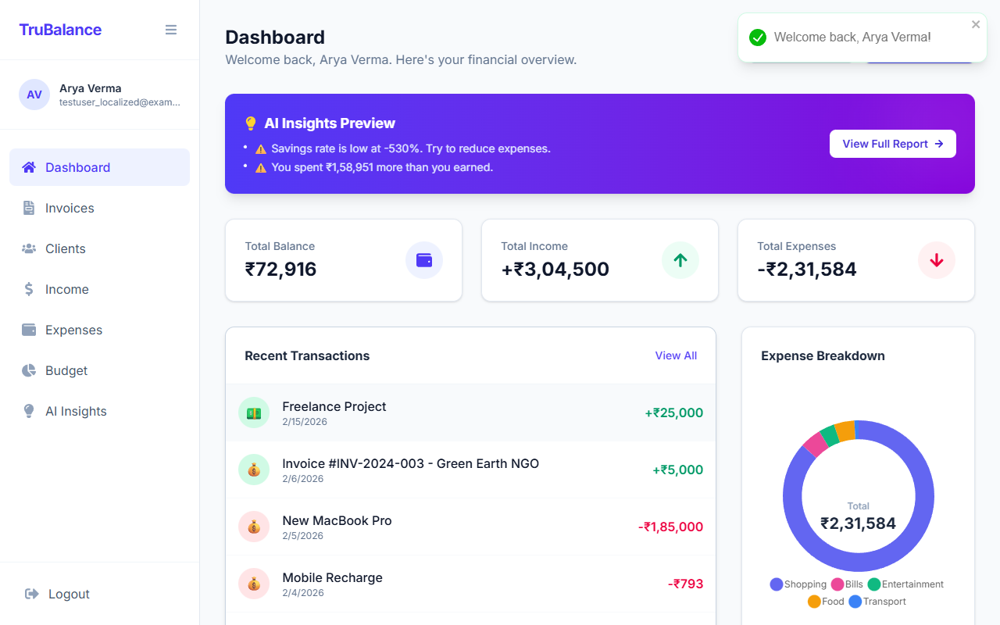
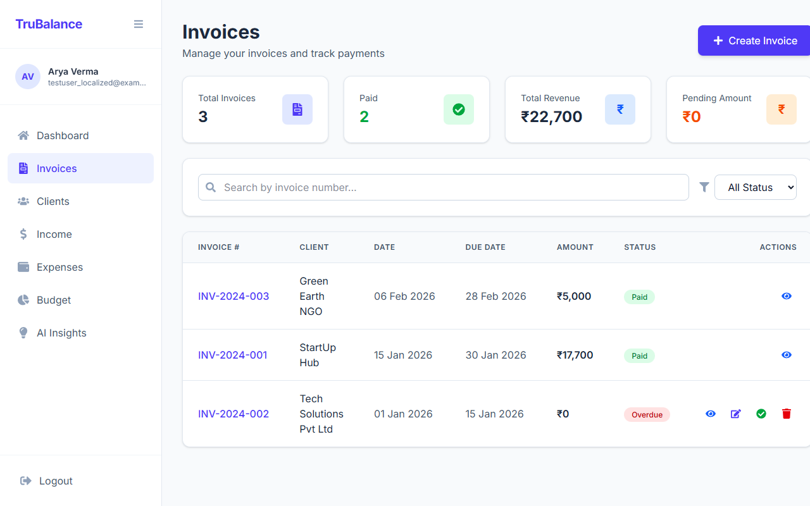
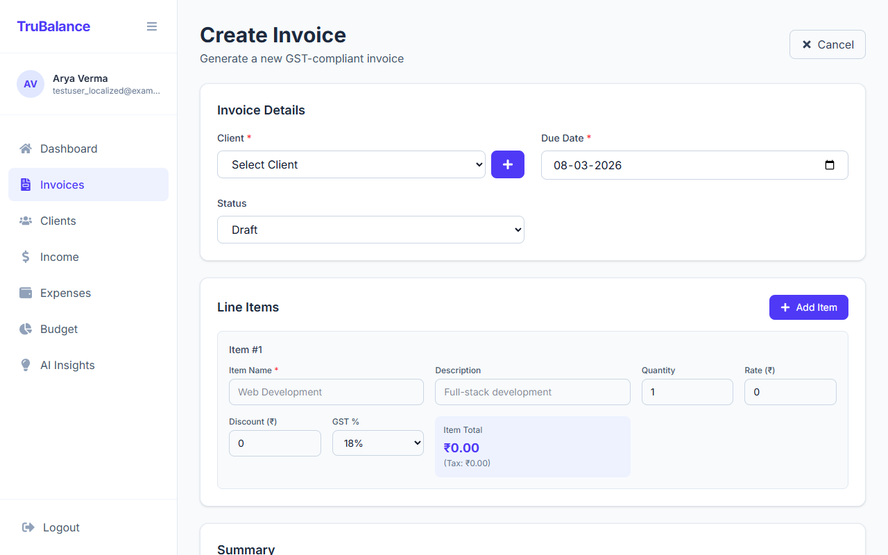
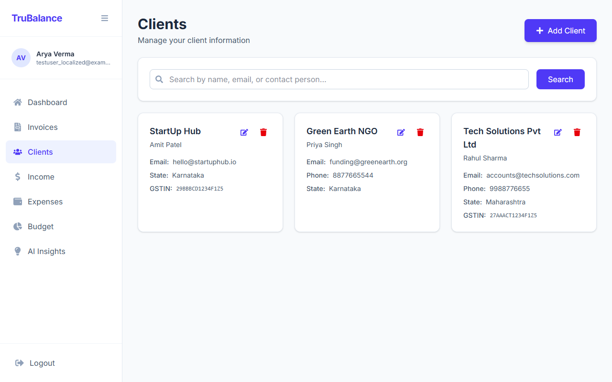
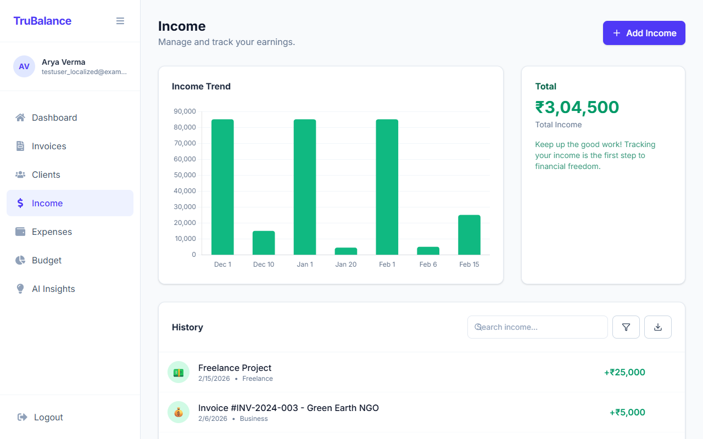
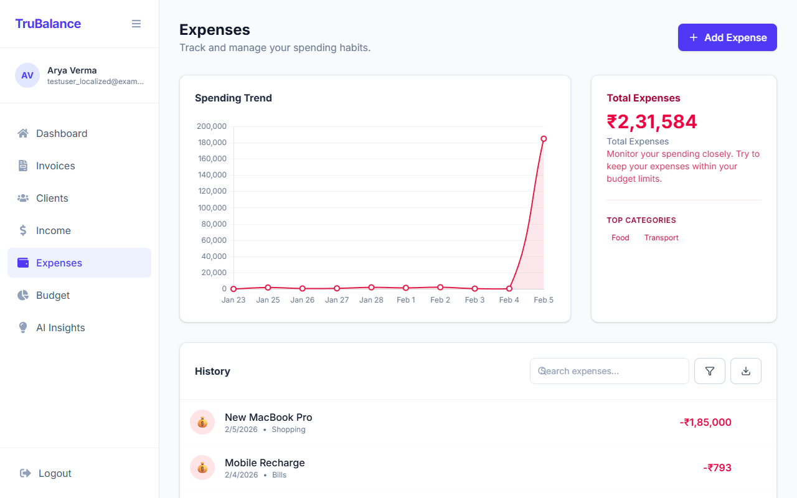
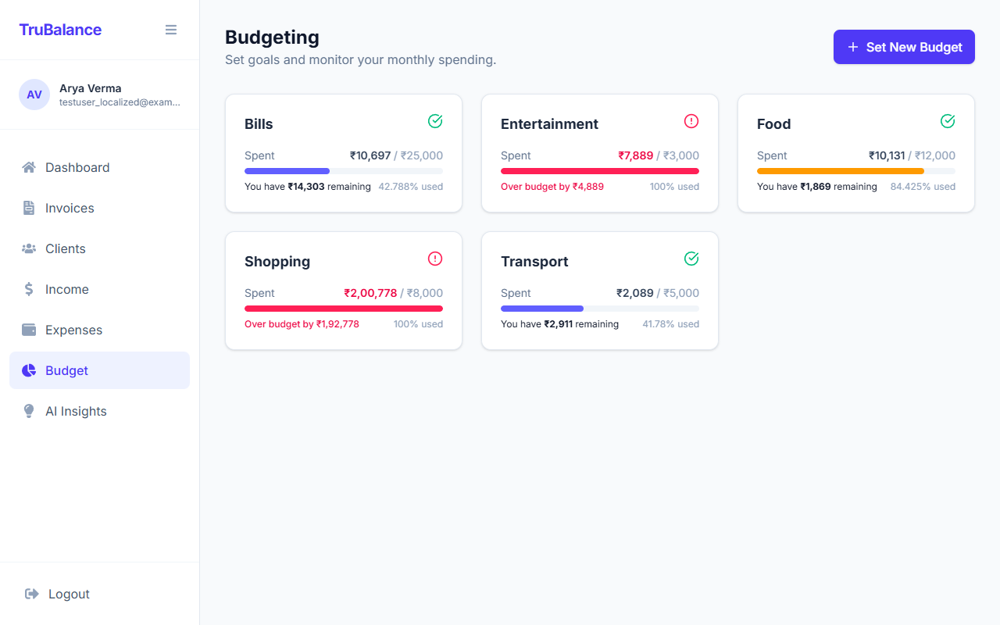
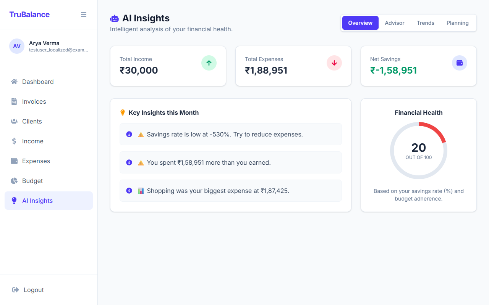

# Truelancer - Smart Expense Tracker & Invoicing App


*(Replace with actual banner or screenshot of dashboard)*

## 🚀 Overview

**Truelancer** is a comprehensive financial management platform engineered for freelancers and small businesses who need more than just a spreadsheet. It unifies professional invoicing, automated income tracking, and AI-driven expense analysis into a single, secure cloud-based solution.

Unlike simple expense trackers, Truelancer is built to be an intelligent financial assistant. It automates mundane tasks—like calculating GST on invoices or categorizing daily expenses—allowing you to focus on growing your business. The platform leverages advanced algorithms to provide actionable insights, helping you visualize cash flow trends and adhere to monthly budgets with precision.

Built on the robust **MERN Stack** (MongoDB, Express.js, React, Node.js), Truelancer offers enterprise-grade security with JWT authentication, responsive design for all devices, and scalable architecture ready for real-world deployment.

### Key Capabilities
- **🧾 Smart GST Invoicing:** Generate professional, tax-compliant invoices with automatic calculations for CGST, SGST, and IGST.
- **🤖 AI-Powered Insights:** Gain a competitive edge with intelligent analysis of your spending habits, identifying cost-saving opportunities and outliers.
- **🔄 Automated Financials:** Seamlessly link invoices to income—marking an invoice as "Paid" instantly updates your revenue ledger.
- **📉 Dynamic Expense Tracking:** Log transactions in seconds and visualize data through interactive charts (Bar, Pie, Line) powered by Recharts.
- **🎯 Smart Budgeting:** Set category-specific spending limits and receive real-time alerts before you overspend.
- **👥 Client Management:** Maintain a centralized database of client details, GSTINs, and billing history for rapid invoice generation.

---

## 🛠️ Technology Stack

- **Frontend:** React, Vite, Tailwind CSS, Recharts
- **Backend:** Node.js, Express.js
- **Database:** MongoDB
- **Authentication:** JWT (JSON Web Tokens)
- **AI Integration:** Google Gemini (for insights and auto-categorization)

---

## 📸 Features & Walkthrough

### 1. Landing Page
Clean and modern landing page introducing the application's value proposition.


### 2. Secure Authentication
Secure user registration and login system to protect your financial data.


### 3. Dashboard
Your financial command center. View real-time stats on total income, expenses, and balance. Quick access buttons allow you to immediately log an expense or create an invoice.


### 4. Invoice Management
Create professional invoices with automatic GST calculation.
*   **Create:** Easy-to-use form for adding clients, line items, and tax details.
*   **Track:** Monitor status (Draft, Sent, Paid, Overdue).
*   **Automated Income:** Mark an invoice as "Paid" and it automatically records as Income.



### 5. Client Management
Keep all your client details in one place for quick invoicing. Store GSTIN, contact details, and addresses.


### 6. Income Tracking
Visualize your earnings with clear charts and transaction history.


### 7. Expense Tracking
Log and categorize expenses to see exactly where your money goes.


### 8. Smart Budgeting
Set limits for categories like Food or Shopping and get alerts when you're close to overspending.


### 9. AI Insights
Get personalized financial advice and monthly reports powered by AI.


---

## ⚙️ Installation & Setup

Follow these steps to run Truelancer locally.

### Prerequisites
*   Node.js (v14+)
*   MongoDB (Local or Atlas URI)

### 1. Clone the Repository
```bash
git clone https://github.com/yourusername/Truelancer.git
cd Truelancer
```

### 2. Backend Setup
Navigate to the server directory and install dependencies:
```bash
cd server
npm install
```

Create a `.env` file in the `server` folder:
```env
PORT=5001
MONGO_URI=your_mongodb_connection_string
JWT_SECRET=your_jwt_secret
GEMINI_API_KEY=your_gemini_api_key
```

Start the backend server:
```bash
npm run dev
```

### 3. Frontend Setup
Open a new terminal, navigate to the client directory, and install dependencies:
```bash
cd client
npm install
```

Create a `.env` file in the `client` folder (optional, defaults are set):
```env
VITE_API_URL=http://localhost:5001
```

Start the frontend development server:
```bash
npm run dev
```

Visit `http://localhost:5173` in your browser to see the app!

---

## 🤝 Contributing

Contributions are welcome! Please fork the repository and submit a pull request for any enhancements or bug fixes.

---

## 📄 License

This project is licensed under the MIT License.
